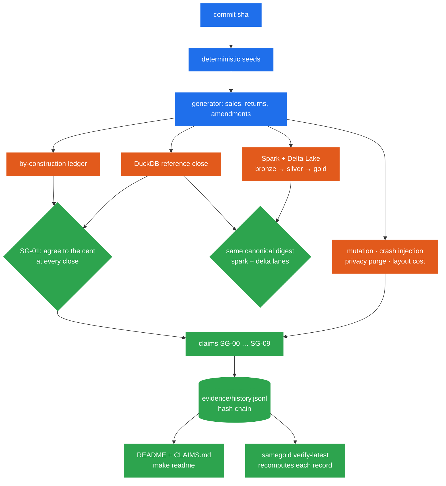

[English](README.md) | **Español**

<div align="center">

# 🥇 samegold

**Un cierre mensual de ingresos sobre Spark y Delta Lake que respalda cada número que publica con
evidencia que cualquiera puede recalcular.**

[](https://github.com/marcosmatalab/samegold/actions/workflows/fast.yml)
[](https://github.com/marcosmatalab/samegold/actions/workflows/spark.yml)
[](https://github.com/marcosmatalab/samegold/actions/workflows/evidence.yml)
[](https://github.com/marcosmatalab/samegold/actions/workflows/databricks.yml)
[](https://github.com/marcosmatalab/samegold/releases/latest)
[](LICENSE)

<!-- samegold:begin stack -->


<!-- samegold:end stack -->

</div>

> [!TIP]
> **En una frase:** samegold cierra los ingresos mensuales de un negocio sobre Spark y Delta
> Lake, conserva cada versión que firmó finanzas y solo publica claims que una máquina puede
> volver a medir.

## 💡 El problema, en pocas palabras

Cada mes, finanzas **cierra el mes**: suma las ventas, resta las devoluciones y firma el
resultado. Un cliente puede devolver un artículo hasta <!--repo:contract.return_window_days-->45<!--/repo--> días después de comprarlo, así que las
devoluciones siguen llegando después de esa firma, y cada una pertenece al mes de la venta
original. Un mes ya cerrado sigue cambiando.

Eso deja a un equipo de datos con dos malas opciones. Si sobrescribe la cifra, desaparece el
número que firmó finanzas. Si la congela, el mes publicado deja de ser cierto. **samegold conserva
las dos cifras:** cada cierre es una versión inmutable, y cada corrección se añade a su lado como una
versión nueva.

**Por qué existe el resto del repositorio.** Una cifra de ingresos que está mal mientras todas las
comprobaciones están en verde es un fallo caro, porque nadie va a buscarlo. Por eso el pipeline es
la parte menor del repositorio, y casi todo lo demás intenta romperlo: una segunda implementación
escrita por separado, mutantes generados de su código, caídas inyectadas en mitad de una escritura
y semillas que no eligió nadie. Cada claim publicada se vuelve a medir en cada ejecución.

## 🎯 Qué hace

- 🧾 **Cierra el mes.** Ventas, devoluciones y rectificaciones fluyen por bronze → silver → gold
  sobre Delta Lake y terminan en un cierre mensual versionado e inmutable.
- ⏳ **Conserva el historial exacto.** Cada versión cerrada se conserva junto a la que la
  sustituyó, así que la cifra que firmó finanzas nunca desaparece.
- ⚖️ **Lo contrasta con una referencia independiente.** El pipeline de Spark y Delta Lake y una
  referencia independiente en DuckDB tienen que producir un único digest canónico, y el despliegue
  en Databricks se contrasta con esa referencia al céntimo, versión a versión.
- 🔬 **Vuelve a medir sus propias afirmaciones.** Cada claim, de `SG-00` a `SG-09`, se vuelve a medir
  con semillas derivadas del sha del commit, se añade a un registro de evidencia encadenado por
  hash y se renderiza en esta página.

## 📊 Métricas clave

**Cada métrica de esta tabla se renderiza desde `evidence/`; ninguna está escrita a mano.** `make
readme` las escribe y `samegold check` hace fallar el build si alguna se aparta de su registro.

| | Qué se mide | Resultado | Claim |
|---|---|---|---|
| ✅ | Vía rápida, sin JVM y sin credenciales | <!--sg:SG-00.artifact.tests_passed-->737<!--/sg--> tests superados en <!--sg:SG-00.artifact.fast_lane_seconds-->79.5<!--/sg--> s | `SG-00` |
| ⚖️ | La referencia DuckDB y el libro mayor por construcción coinciden en cada cierre | <!--sg:SG-01.rate-->15/15 (95% CI 79.6%-100.0%)<!--/sg--> | `SG-01` |
| 🔁 | Reentregar todos los ficheros con otra ruta no cambia nada | <!--sg:SG-02.rate-->3/3 (95% CI 43.9%-100.0%)<!--/sg--> | `SG-02` |
| 🧬 | Mutantes SQL generados no equivalentes que el arnés mata | <!--sg:SG-03.rate-->67/67 (95% CI 94.6%-100.0%)<!--/sg--> | `SG-03` |
| ⏳ | Meses cerrados que se movieron tras la firma, con cada versión igual a la referencia | <!--sg:SG-04.rate-->2/2 (95% CI 34.2%-100.0%)<!--/sg--> | `SG-04` |
| 🧮 | Invariantes de dimensión y de conservación, sin oráculo | <!--sg:SG-05.rate-->3/3 (95% CI 43.9%-100.0%)<!--/sg--> | `SG-05` |
| 🔗 | Registros de evidencia verificados en la cadena de hashes | <!--sg:SG-06.artifact.records_verified-->251<!--/sg--> | `SG-06` |
| 💥 | Caídas inyectadas que el escritor de silver sobrevive | <!--sg:SG-07.rate-->20/20 (95% CI 83.9%-100.0%)<!--/sg--> | `SG-07` |
| 🔒 | Identificadores directos fuera de gold, con la purga verificada | <!--sg:SG-08.rate-->6/6 (95% CI 61.0%-100.0%)<!--/sg--> | `SG-08` |
| 📦 | Ficheros eliminados por la compactación | <!--sg:SG-09.artifact.files_removed_by_compaction_pct-->92.5<!--/sg-->% | `SG-09` |
| 📉 | Reducción de la parte de la tabla que lee una consulta por sku, gracias al clustering | <!--sg:SG-09.artifact.share_read_reduction_pct-->78.25<!--/sg-->% | `SG-09` |
| ☁️ | Eventos que cerró la vía de Databricks, con cada versión igual al céntimo a la vía de código abierto | <!--dbx:rows.bronze_events-->1883<!--/dbx--> eventos | `SG-DBX-01` |
| 🧱 | Arnés de verificación frente a código de plataforma, en líneas | <!--sg:SG-00.artifact.harness_lines-->23 967<!--/sg--> frente a <!--sg:SG-00.artifact.platform_lines-->7 567<!--/sg--> | `SG-00` |

## 🚀 Pruébalo en minutos

Sin cuenta, sin credenciales, sin más red que PyPI.

```bash
git clone https://github.com/marcosmatalab/samegold && cd samegold
make install
make demo                 # the close, and the month that moved after it was signed off
make fast                 # the whole fast lane, no JVM
make refute SEED=424242   # the data claims again, on a seed nobody chose
```

Lo que imprime `make demo`:

<!-- samegold:begin demo -->
```text
samegold demo - 772 events, 301 files, seed 3606824677207351751

  Month 2026-01 was closed at 2026-02-05 reporting 150 658,58 EUR of net revenue.
  By 2026-04-05, late returns and late amendments had moved it to 147 227,51 EUR.
  That is -3 431,07 EUR, -2.28% of a month that finance had already signed off.

  The customer dimension is well formed: yes.
  Two implementations of that number are compared on this data by `samegold evidence`.

  No account, no credentials, nothing installed beyond this package.
```
<!-- samegold:end demo -->

**Ese bloque sale de ejecutar la demo, no está pegado,** y `samegold check` la vuelve a
ejecutar y falla si cambia un solo byte. La demo usa una semilla fija, así que imprime lo
mismo en cada commit hasta que cambia el código; las claims de abajo mantienen semillas
derivadas del sha del commit.

**El último comando es la clave.** Las semillas derivan del sha del commit, así que no se puede
elegir una favorable sin hacer un commit nuevo, que queda en el historial. `make refute` deja que
cualquiera elija la suya y ejecuta con ella todas las claims sobre los datos, lo que convierte
cada una en una invitación a refutarla.


**Una grabación real, no una animación:** reproducida a <!--repo:gif.refute.speed-->4x<!--/repo-->, sobre una ejecución real de <!--repo:gif.refute.real_seconds-->73,1 s<!--/repo-->.
[`docs/refute.tape`](docs/refute.tape) es el guion que ejecuta `vhs`, y `make gif` la vuelve a
grabar desde una ejecución nueva.

`make preflight` es la puerta antes de un push y `make doctor` informa de lo que esta máquina
puede ejecutar.

## 🏗️ Arquitectura

<picture>
  <source media="(prefers-color-scheme: dark)" srcset="docs/img/pipeline-dark.svg">
  
</picture>

**Un pipeline medallion con un contrato en la puerta.** Los eventos en bruto llegan a
`bronze_events`, `silver_classified` aplica el contrato de datos, los registros inválidos van a
`silver_quarantine`, y gold contiene `revenue_by_month`, una dimensión de clientes de Tipo 2
`dim_customer_scd2` y el cierre versionado `revenue_closed`.

**El diagrama se comprueba contra el código.**
`tests/fast/test_documentation.py::test_the_figures_agree_with_the_repository` deriva los nombres
de las tablas y las lecturas entre ellas parseando `databricks/src/`, y las cifras de dinero de
`evidence/databricks/SG-DBX-01.json`, así que una tabla renombrada o una flecha invertida hacen
fallar el build.

## ⏳ El cierre bitemporal

<picture>
  <source media="(prefers-color-scheme: dark)" srcset="docs/img/restatement-dark.svg">
  
</picture>

Una devolución puede llegar hasta <!--repo:contract.return_window_days-->45<!--/repo--> días después de la venta y se imputa al mes de la **venta**. Por
eso el cierre sigue dos ejes de tiempo: cuándo ocurrió algo y cuándo se enteró el negocio. La
versión que firmó finanzas se queda exactamente como estaba, al lado de la que la sustituyó, y
`SG-04` mide cuánto se mueve cada mes cerrado y contrasta cada versión con la referencia DuckDB en
cada ejecución.

**Enero, cerrado tres veces en Databricks, sin reescribir ninguna versión:** un bruto de
<!--dbx:closed.2026_01.v0.gross_cents-->14 198 046<!--/dbx--> céntimos en la firma, <!--dbx:closed.2026_01.v1.gross_cents-->25 582 615<!--/dbx--> tras los primeros eventos tardíos y
<!--dbx:closed.2026_01.v2.gross_cents-->37 622 605<!--/dbx--> tras los segundos, cada uno igual al
céntimo a la vía de código abierto. La vía se ejecutó de principio a fin en Databricks Free Edition.
[`docs/postmortem-2026-03-06.md`](docs/postmortem-2026-03-06.md) documenta la reexpresión como un
informe de incidente.

## 🔬 Cómo se demuestra cada número



Las claims de abajo se renderizan desde `evidence/history.jsonl`, una cadena de hashes que
solo admite añadidos, a partir del registro más reciente de cada claim. Cuando la población cambia, las
claims se vuelven a ejecutar y se añade un registro nuevo, y los que ya están en la cadena se
quedan como están: **nunca se edita ni se reemplaza** un registro.
[ADR 0010](docs/adr/0010-the-chain-is-append-only-and-the-documents-quote-its-head.md) es la
política completa. La tabla se genera a partir de los registros, por eso aparece en inglés en las
dos portadas.

<!-- samegold:begin claims -->

| claim | result | experiment | runtime | provenance |
|---|---|---|---|---|
| `SG-00` what this repository contains, counted | PASS | 737/737 (95% CI 99.5%-100.0%) | oss-local | [CI, d69164100](https://github.com/marcosmatalab/samegold/actions/runs/35782684308) |
| `SG-01` two implementations agree on the close | PASS | 15/15 (95% CI 79.6%-100.0%) | oss-local | [CI, d69164100](https://github.com/marcosmatalab/samegold/actions/runs/35782684308) |
| `SG-02` re-delivery under a new path is a no-op | PASS | 3/3 (95% CI 43.9%-100.0%) | oss-local | [CI, d69164100](https://github.com/marcosmatalab/samegold/actions/runs/35782684308) |
| `SG-03` mutation campaign | PASS | 67/67 (95% CI 94.6%-100.0%) | oss-local | [CI, d69164100](https://github.com/marcosmatalab/samegold/actions/runs/35782684308) |
| `SG-04` a closed month moves after it is closed | PASS | 2/2 (95% CI 34.2%-100.0%) | oss-local | [CI, d69164100](https://github.com/marcosmatalab/samegold/actions/runs/35782684308) |
| `SG-05` dimension and conservation invariants hold without an oracle | PASS | 3/3 (95% CI 43.9%-100.0%) | oss-local | [CI, d69164100](https://github.com/marcosmatalab/samegold/actions/runs/35782684308) |
| `SG-06` the evidence chain verifies and every seed derives from its commit | PASS | 251/251 (95% CI 98.5%-100.0%) | oss-local | [CI, d69164100](https://github.com/marcosmatalab/samegold/actions/runs/35782684308) |
| `SG-07` the silver writer survives a crash at each of its structural points | PASS | 20/20 (95% CI 83.9%-100.0%) | oss-local | [CI, d69164100](https://github.com/marcosmatalab/samegold/actions/runs/35782684308) |
| `SG-08` no direct identifier reaches gold, and a purge really purges | PASS | 6/6 (95% CI 61.0%-100.0%) | oss-local | [CI, d69164100](https://github.com/marcosmatalab/samegold/actions/runs/35782684308) |
| `SG-09` what layout costs, in files and bytes | PASS | 5/5 (95% CI 56.6%-100.0%) | oss-local | [CI, d69164100](https://github.com/marcosmatalab/samegold/actions/runs/35782684308) |

<!-- samegold:end claims -->

**Cada fila enlaza la ejecución de CI que la produjo, y `samegold verify-latest` recalcula cada
una desde las semillas que nombra su propio registro.** Un registro bien formado no basta: el
número se tiene que reproducir. [ADR 0011](docs/adr/0011-the-gate-recomputes-the-record.md)
documenta la puerta de recálculo.

## ☁️ La vía de Databricks

<picture>
  <source media="(prefers-color-scheme: dark)" srcset="docs/img/job-graph-dark.svg">
  
</picture>

**Desplegada y ejecutada de principio a fin en un workspace real de Databricks.** Un Databricks
Asset Bundle despliega un pipeline de Lakeflow y un job de cierre mensual cuya tarea condicional
decide la rama según si el cierre reexpresó un mes. Los registros de ejecución están versionados
en [`evidence/databricks/`](evidence/databricks/) con sus ids de job run, de pipeline y de
update, y [`docs/databricks-run-evidence.md`](docs/databricks-run-evidence.md) renderiza lo que
midió el workspace: la dimensión de Tipo 2 fila a fila con su `__START_AT` y su `__END_AT`, las
versiones cerradas, las expectativas con sus recuentos de aciertos y fallos, y cada evento que el
contrato rechazó.

**Verificado desde un clon, sin cuenta:**
<!--sg:SG-00.artifact.tests_databricks_bundle-->135<!--/sg--> tests ejercitan `databricks/` y
`scripts/databricks_run.sh` contra una CLI simulada en el `PATH`: cada ruta de notebook, cada
widget y cada parámetro del job, el techo de tareas concurrentes calculado a partir del grafo de
dependencias de arriba, y la comprobación que se niega a ejecutar un job desplegado desde un commit que
no es `HEAD`.

**Seguro por diseño.** `.github/workflows/databricks.yml` solo acepta `workflow_dispatch`, usa
`validate` por defecto, no arranca compute, fija cada action a un sha de commit y lee su token de
un entorno de GitHub en lugar de un secreto del repositorio; como no tiene disparador
`pull_request`, el pull request de un fork no puede alcanzarlo.

## ⚖️ Decisiones de diseño y trade-offs

Cada decisión está documentada como un registro de decisión de arquitectura (ADR), con las
alternativas que descartó y el motivo.

| Decisión | Por qué | Trade-off aceptado | ADR |
|---|---|---|---|
| **Una segunda implementación, no más aserciones** | Los tests unitarios están ciegos en los mismos sitios que el código que prueban; un cálculo independiente no | Dos implementaciones que mantener, y comparten autor, así que su acuerdo es evidencia sólida y no una prueba | [0001](docs/adr/0001-a-second-implementation-instead-of-more-tests.md) |
| **Compartir el contrato, duplicar el cálculo** | Los nombres de columna, la ventana de <!--repo:contract.return_window_days-->45<!--/repo--> días, la zona horaria y la moneda se definen una vez; cada derivación se escribe dos veces, así que un malentendido aparece como un desacuerdo | Cada regla de negocio existe dos veces, en código DataFrame y en SQL | [0004](docs/adr/0004-what-is-shared-between-implementations.md) |
| **La ejecución adaptativa sigue activada** | Lo que se prueba es la configuración de producción | La paridad se comprueba sobre un digest ordenado, nunca byte a byte sobre los ficheros, así que cada proyección tiene que declarar un orden total | [0005](docs/adr/0005-adaptive-execution-stays-on.md) |
| **Las semillas derivan del sha del commit** | No se puede elegir en silencio una semilla favorable | Cada commit cambia la población sintética, así que las cifras se mueven entre commits; por eso se renderizan en lugar de escribirse a mano | [0007](docs/adr/0007-the-evidence-gate.md) |
| **La evidencia solo admite añadidos** | Una cifra desfasada se corrige añadiendo una medición, así que todas las anteriores se pueden seguir inspeccionando | El historial solo crece, y la página cita el último registro, que puede ser anterior al último commit | [0010](docs/adr/0010-the-chain-is-append-only-and-the-documents-quote-its-head.md) |
| **El coste se mide en ficheros y bytes, no en segundos** | Las cifras salen de las estadísticas por fichero del log de Delta, así que son idénticas en cualquier máquina | No dicen nada sobre la latencia real | [0008](docs/adr/0008-cost-is-measured-in-files-and-bytes.md) |
| **Los controles de privacidad se ejecutan en código** | Se ejecutan y se prueban en cada ejecución, y la comprobación de exposición lee la salida en vez de fiarse del paso de enmascarado | Un control en código se puede eludir con otro pipeline; los permisos de plataforma solo se declaran, para un workspace con grupos | [0009](docs/adr/0009-governance-in-code.md) |
| **La vía de Delta falla cuando no puede verificar** | Una vía que no pudo ejecutar sus comprobaciones no debe informar de éxito | Detrás de un proxy que bloquea Maven Central, la vía falla en lugar de omitirse | [0013](docs/adr/0013-the-delta-lane-fails-when-it-cannot-verify.md) |

## 🧭 Dónde mirar

| Para ver | Ve a |
|---|---|
| El pipeline de Spark y Delta Lake | `src/samegold/pipelines/` |
| La referencia SQL independiente | `src/samegold/oracle/gold_revenue.sql` |
| El contrato de datos que comparten las dos | `src/samegold/domain/contract.py` |
| El generador de datos sintéticos y su libro mayor | `src/samegold/generator/` |
| El bundle de Databricks, el pipeline y el job de cierre | `databricks/` |
| Las pruebas de mutación | `src/samegold/mutation/` |
| La inyección de fallos | `src/samegold/faults/` |
| La cadena de evidencia y el renderizador del README | `src/samegold/evidence/` |
| Las vías de test de Spark y Delta | `tests/spark/` · `tests/delta/` |
| CI | `.github/workflows/` |

## 🧰 Stack técnico

| Capa | Tecnología |
|---|---|
| ⚙️ Procesamiento | PySpark · Delta Lake · delta-rs · arquitectura medallion · SCD de Tipo 2 |
| ☁️ Nube | Databricks Asset Bundles · pipelines de Lakeflow · Jobs con tareas condicionales · Unity Catalog |
| 🦆 Motor de referencia | DuckDB, que calcula el mismo cierre de forma independiente |
| 🧪 Verificación | pytest · Hypothesis · mutantes SQL generados con sqlglot · inyección de fallos · intervalos de Wilson |
| 🔗 Evidencia | cadena de hashes JSONL que solo admite añadidos · semillas derivadas del sha del commit |
| 🛠️ Calidad | Python · ruff · mypy strict · GitHub Actions: fast, spark, evidence, databricks |

## 🗺️ Documentación

- [`docs/how-it-works.md`](docs/how-it-works.md) - el diseño: tres testigos, el digest, la puerta de evidencia, lo que cuesta el layout
- [`CLAIMS.md`](CLAIMS.md) - cada claim, su experimento y su alcance
- [`FINDINGS.md`](FINDINGS.md) - el registro de revisión adversarial: cada defecto que cazó el arnés, ordenado por lo que enseña
- [`CHANGELOG.md`](CHANGELOG.md) - qué cambió cada versión
- [`docs/adr/`](docs/adr/) - las decisiones de arquitectura, cada una con la alternativa que rechazó y por qué
- [`docs/databricks-run.md`](docs/databricks-run.md) - qué despliega la vía de la nube y qué ejecutó
- [`docs/databricks-run-evidence.md`](docs/databricks-run-evidence.md) - qué midió el workspace, renderizado desde los registros que dejó
- [`docs/runbook.md`](docs/runbook.md) - runbook de guardia: qué significa una alerta, problema de datos o de plataforma, y cómo reparar una ejecución
- [`docs/findings/`](docs/findings/) - los informes de lo que encontró la puerta de recálculo
- [`docs/join-skew.md`](docs/join-skew.md) - una clave se lleva una gran parte de las filas: qué le pasa al join, medido
- [`EXAM_MAP.md`](EXAM_MAP.md) - la guía de Databricks Professional, objetivo por objetivo
- [`PARITY.md`](PARITY.md) - la vía de código abierto frente a Databricks, claim a claim
- [`CONTRIBUTING.md`](CONTRIBUTING.md) - cómo contribuir: `make preflight` es la puerta
- [`docs/limits.md`](docs/limits.md) - limitaciones conocidas y riesgo residual

Apache-2.0.
