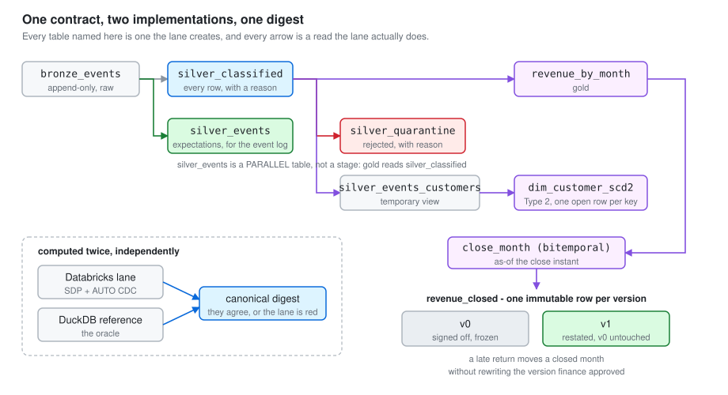
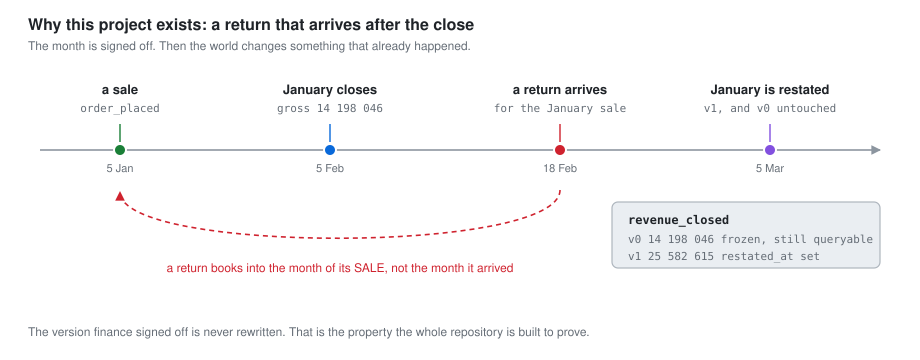
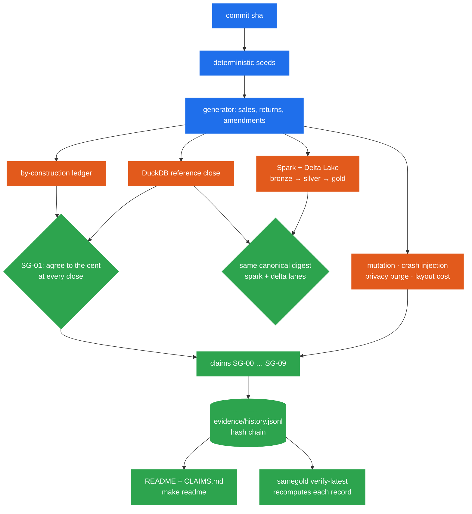
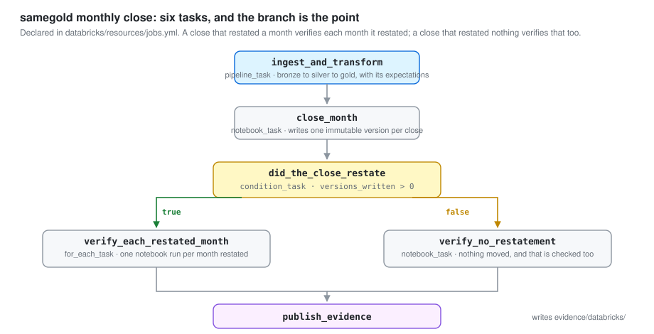

**English** | [Español](README.es.md)

<div align="center">

# 🥇 samegold

**A month-end revenue close on Spark and Delta Lake that backs every number it publishes with
evidence anyone can recompute.**

[](https://github.com/marcosmatalab/samegold/actions/workflows/fast.yml)
[](https://github.com/marcosmatalab/samegold/actions/workflows/spark.yml)
[](https://github.com/marcosmatalab/samegold/actions/workflows/evidence.yml)
[](https://github.com/marcosmatalab/samegold/actions/workflows/databricks.yml)
[](https://github.com/marcosmatalab/samegold/releases/latest)
[](LICENSE)


🧾 bitemporal close · ⚖️ cross-engine parity · 🧬 mutation testing · 💥 crash injection · 🔒 privacy purge · 🔗 hash-chained evidence

</div>

> [!TIP]
> **In one sentence:** samegold closes a business's monthly revenue on Spark and Delta Lake,
> keeps every signed-off version when late returns move a month, checks the close against an
> independent reference that must agree to the cent, and publishes every claim from measurements
> that are hash-chained and can be recomputed on demand.

## 🎯 What it does

- 🧾 **Closes the month.** Sales, returns and amendments flow bronze → silver → gold on Delta
  Lake and land in a versioned, immutable monthly revenue close.
- ⏳ **Keeps history exact.** A return books into the month of the sale, so a month finance has
  already signed off can move. Every closed version is kept beside the one that replaced it.
- ⚖️ **Checks it against an independent reference.** The Spark and Delta Lake pipeline and an
  independent DuckDB reference must produce one canonical digest, and the Databricks deployment
  is checked against that reference to the cent, version by version.
- 🔬 **Re-measures its own claims.** Each claim, `SG-00` to `SG-09`, is re-measured from seeds derived
  from the commit sha, appended to a hash-chained evidence log and rendered onto this page.

## 📊 Key metrics

**Every metric in this table is rendered from `evidence/`, not typed by hand.** `make readme`
writes them and `samegold check` fails the build if one drifts from its record.

| | What is measured | Result | Claim |
|---|---|---|---|
| ✅ | Fast lane, no JVM and no credentials | <!--sg:SG-00.artifact.tests_passed-->737<!--/sg--> tests pass in <!--sg:SG-00.artifact.fast_lane_seconds-->79.5<!--/sg--> s | `SG-00` |
| ⚖️ | DuckDB reference and by-construction ledger agree at every close | <!--sg:SG-01.rate-->15/15 (95% CI 79.6%-100.0%)<!--/sg--> | `SG-01` |
| 🔁 | Re-delivering every file under a new path changes nothing | <!--sg:SG-02.rate-->3/3 (95% CI 43.9%-100.0%)<!--/sg--> | `SG-02` |
| 🧬 | Non-equivalent generated SQL mutants killed | <!--sg:SG-03.rate-->67/67 (95% CI 94.6%-100.0%)<!--/sg--> | `SG-03` |
| ⏳ | Closed months that moved after sign-off, every version matching the reference | <!--sg:SG-04.rate-->2/2 (95% CI 34.2%-100.0%)<!--/sg--> | `SG-04` |
| 🧮 | Dimension and conservation invariants, no oracle needed | <!--sg:SG-05.rate-->3/3 (95% CI 43.9%-100.0%)<!--/sg--> | `SG-05` |
| 🔗 | Evidence records verified in the hash chain | <!--sg:SG-06.artifact.records_verified-->251<!--/sg--> | `SG-06` |
| 💥 | Injected crashes the silver writer survives | <!--sg:SG-07.rate-->20/20 (95% CI 83.9%-100.0%)<!--/sg--> | `SG-07` |
| 🔒 | Direct identifiers kept out of gold, purge verified | <!--sg:SG-08.rate-->6/6 (95% CI 61.0%-100.0%)<!--/sg--> | `SG-08` |
| 📦 | Files removed by compaction | <!--sg:SG-09.artifact.files_removed_by_compaction_pct-->92.5<!--/sg-->% | `SG-09` |
| 📉 | Cut in the share of the table a sku query reads, from clustering | <!--sg:SG-09.artifact.share_read_reduction_pct-->78.25<!--/sg-->% | `SG-09` |
| ☁️ | Events the Databricks lane closed, every version matching the open-source lane to the cent | <!--dbx:rows.bronze_events-->1883<!--/dbx--> events | `SG-DBX-01` |
| 🧱 | Verification harness against platform code, in lines | <!--sg:SG-00.artifact.harness_lines-->23 967<!--/sg--> against <!--sg:SG-00.artifact.platform_lines-->7 567<!--/sg--> | `SG-00` |

## 🚀 Try it in minutes

No account, no credentials, no network beyond PyPI.

```bash
git clone https://github.com/marcosmatalab/samegold && cd samegold
make install
make demo                 # the close, and the month that moved after it was signed off
make fast                 # the whole fast lane, no JVM
make refute SEED=424242   # the seven data claims again, on a seed nobody chose
```

What `make demo` prints:

<!-- samegold:begin demo -->
```text
samegold demo - 772 events, 301 files, seed 3606824677207351751

  Month 2026-01 was closed at 2026-02-05 reporting 150 658,58 EUR of net revenue.
  By 2026-04-05, late returns and late amendments had moved it to 147 227,51 EUR.
  That is -3 431,07 EUR, -2.28% of a month that finance had already signed off.

  The customer dimension is well formed: yes.
  Two implementations of that number are compared on this data by `samegold evidence`.

  0.2s, no account, no credentials, nothing installed beyond this package.
```
<!-- samegold:end demo -->

**That output is rendered from the evidence, not pasted,** so it always matches what the
program prints on the current commit.

**The last command is the point.** Seeds derive from the commit sha, so a favourable seed cannot
be picked without making a new commit, which the history shows. `make refute` lets anyone choose
their own and runs the seven claims about the data on it, which turns each of them into an
invitation to falsify it.


**A real recording, not an animation:** played at 4x, over a real run of 73,1 s.
[`docs/refute.tape`](docs/refute.tape) is the script `vhs` executes, and `make gif` re-records
it from a fresh run.

`make preflight` is the gate before a push and `make doctor` reports what this machine can run.

## 🏗️ Architecture

<picture>
  <source media="(prefers-color-scheme: dark)" srcset="docs/img/pipeline-dark.svg">
  
</picture>

**A medallion pipeline with a contract at the door.** Raw events land in `bronze_events`,
`silver_classified` applies the data contract, invalid records go to `silver_quarantine`, and
gold holds `revenue_by_month`, a Type 2 customer dimension `dim_customer_scd2` and the
versioned close `revenue_closed`.

**The diagram is tested against the code.**
`tests/fast/test_documentation.py::test_the_figures_agree_with_the_repository` derives the table
names and the reads between them by parsing `databricks/src/`, and the money figures from
`evidence/databricks/SG-DBX-01.json`, so a renamed table or a reversed arrow fails the build.

## ⏳ The bitemporal close

<picture>
  <source media="(prefers-color-scheme: dark)" srcset="docs/img/restatement-dark.svg">
  
</picture>

A return may arrive up to 45 days after the sale and books into the month of the **sale**. The close
therefore tracks two time axes: when something happened and when the business learned about it.
The version finance signed off stays exactly as it was, next to the one that replaced it, and
`SG-04` measures how far each closed month moves and checks every version against the DuckDB
reference on every run.

**January, closed three times on Databricks, with no version rewritten:** gross 14 198 046 cents
at sign-off, 25 582 615 after the first late arrivals, and
<!--dbx:revenue.2026_01.gross_cents-->37 622 605<!--/dbx--> after the second, each matching the
open-source lane to the cent. The lane ran end to end on Databricks Free Edition.
[`docs/postmortem-2026-03-06.md`](docs/postmortem-2026-03-06.md) writes the restatement up as an
incident report.

## 🔬 How every number is proven



The claims below are rendered from `evidence/history.jsonl`, an append-only hash chain, using the
most recent record for each claim. When the population moves, the claims run again and a new
record is appended, and the ones already in the chain are kept as they are:
**never edit or replace** a record. [ADR 0010](docs/adr/0010-the-chain-is-append-only-and-the-documents-quote-its-head.md) is
the full policy.

<!-- samegold:begin claims -->

| claim | result | experiment | runtime | provenance |
|---|---|---|---|---|
| `SG-00` what this repository contains, counted | PASS | 737/737 (95% CI 99.5%-100.0%) | oss-local | [CI, d69164100](https://github.com/marcosmatalab/samegold/actions/runs/35782684308) |
| `SG-01` two implementations agree on the close | PASS | 15/15 (95% CI 79.6%-100.0%) | oss-local | [CI, d69164100](https://github.com/marcosmatalab/samegold/actions/runs/35782684308) |
| `SG-02` re-delivery under a new path is a no-op | PASS | 3/3 (95% CI 43.9%-100.0%) | oss-local | [CI, d69164100](https://github.com/marcosmatalab/samegold/actions/runs/35782684308) |
| `SG-03` mutation campaign | PASS | 67/67 (95% CI 94.6%-100.0%) | oss-local | [CI, d69164100](https://github.com/marcosmatalab/samegold/actions/runs/35782684308) |
| `SG-04` a closed month moves after it is closed | PASS | 2/2 (95% CI 34.2%-100.0%) | oss-local | [CI, d69164100](https://github.com/marcosmatalab/samegold/actions/runs/35782684308) |
| `SG-05` dimension and conservation invariants hold without an oracle | PASS | 3/3 (95% CI 43.9%-100.0%) | oss-local | [CI, d69164100](https://github.com/marcosmatalab/samegold/actions/runs/35782684308) |
| `SG-06` the evidence chain verifies and every seed derives from its commit | PASS | 251/251 (95% CI 98.5%-100.0%) | oss-local | [CI, d69164100](https://github.com/marcosmatalab/samegold/actions/runs/35782684308) |
| `SG-07` the silver writer survives a crash at each of its structural points | PASS | 20/20 (95% CI 83.9%-100.0%) | oss-local | [CI, d69164100](https://github.com/marcosmatalab/samegold/actions/runs/35782684308) |
| `SG-08` no direct identifier reaches gold, and a purge really purges | PASS | 6/6 (95% CI 61.0%-100.0%) | oss-local | [CI, d69164100](https://github.com/marcosmatalab/samegold/actions/runs/35782684308) |
| `SG-09` what layout costs, in files and bytes | PASS | 5/5 (95% CI 56.6%-100.0%) | oss-local | [CI, d69164100](https://github.com/marcosmatalab/samegold/actions/runs/35782684308) |

<!-- samegold:end claims -->

**Every row links the CI run that produced it, and `samegold verify-latest` recomputes each one
from the seeds its own record names.** A well-formed record is not enough: the number has to
reproduce. [ADR 0011](docs/adr/0011-the-gate-recomputes-the-record.md) documents the recompute
gate.

## ☁️ The Databricks lane

<picture>
  <source media="(prefers-color-scheme: dark)" srcset="docs/img/job-graph-dark.svg">
  
</picture>

**Deployed and run end to end on a real Databricks workspace.** A Databricks Asset Bundle
deploys a Lakeflow pipeline and a monthly close job whose condition task branches on whether the
close restated a month. The run records are committed under
[`evidence/databricks/`](evidence/databricks/) with their job run, pipeline and update ids, and
[`docs/databricks-run-evidence.md`](docs/databricks-run-evidence.md) renders what the workspace
measured: the Type 2 dimension row by row with its `__START_AT` and `__END_AT`, the closed
versions, the expectations with their pass and fail counts, and every event the contract refused.

**Verified from a clone, with no account:**
<!--sg:SG-00.artifact.tests_databricks_bundle-->135<!--/sg--> tests drive `databricks/` and
`scripts/databricks_run.sh` against a stub CLI on `PATH`: every notebook path, widget and job
parameter, the concurrent-task ceiling computed from the dependency graph above, and the guard
that refuses to run a job deployed from a commit that is not `HEAD`.

**Secure by design.** `.github/workflows/databricks.yml` takes `workflow_dispatch` only, defaults
to `validate`, starts no compute, pins every action to a commit sha and reads its token from a
GitHub environment rather than a repository secret; with no `pull_request` trigger, a fork's pull
request cannot reach it.

## 🧰 Tech stack

| Layer | Technology |
|---|---|
| ⚙️ Processing | PySpark 4.2.0 · Delta Lake 4.4.0 · delta-rs 1.6 · medallion architecture · SCD Type 2 |
| ☁️ Cloud | Databricks Asset Bundles · Lakeflow pipelines · Jobs with condition tasks · Unity Catalog |
| 🦆 Reference engine | DuckDB, computing the same close independently |
| 🧪 Verification | pytest · Hypothesis · SQL mutants generated with sqlglot · crash injection · Wilson 95% intervals |
| 🔗 Evidence | append-only JSONL hash chain · seeds derived from the commit sha |
| 🛠️ Quality | Python 3.11+ · ruff · mypy strict · GitHub Actions: fast, spark, evidence, databricks |

## 🗺️ Documentation

- [`docs/how-it-works.md`](docs/how-it-works.md) - the design: three witnesses, the digest, the evidence gate, what layout costs
- [`CLAIMS.md`](CLAIMS.md) - every claim, its experiment and its scope
- [`FINDINGS.md`](FINDINGS.md) - the adversarial review log: every defect the harness caught, by what it teaches
- [`CHANGELOG.md`](CHANGELOG.md) - what each release changed
- [`docs/adr/`](docs/adr/) - the architecture decisions, each with the alternative it rejected and why
- [`docs/databricks-run.md`](docs/databricks-run.md) - what the cloud lane deploys and what it ran
- [`docs/databricks-run-evidence.md`](docs/databricks-run-evidence.md) - what the workspace measured, rendered from the records it left
- [`docs/runbook.md`](docs/runbook.md) - on-call runbook: what an alert means, data problem or platform problem, and how to repair a run
- [`docs/findings/`](docs/findings/) - write-ups of what the recompute gate found
- [`docs/join-skew.md`](docs/join-skew.md) - one key takes 30% of the rows: what happens to the join, measured
- [`EXAM_MAP.md`](EXAM_MAP.md) - the Databricks Professional guide, objective by objective
- [`PARITY.md`](PARITY.md) - open-source lane against Databricks, claim by claim
- [`CONTRIBUTING.md`](CONTRIBUTING.md) - how to contribute: `make preflight` is the gate
- [`docs/limits.md`](docs/limits.md) - known limitations and residual risk

Apache-2.0.
