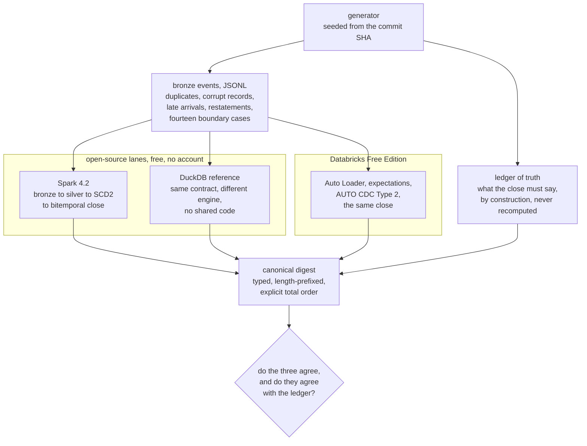
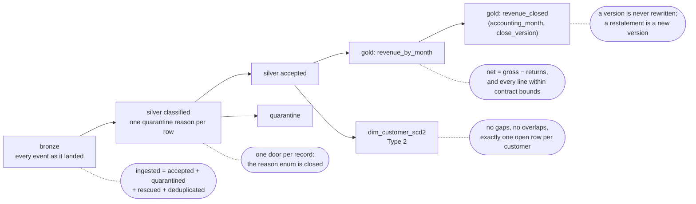
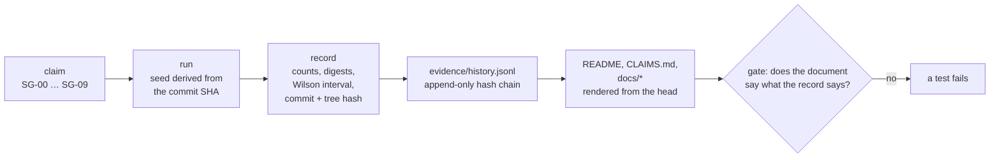

# How it works

Moved out of the README on 6 September 2026, when the front page was 389 lines long and a
reviewer's first complaint was that nobody would read it. Nothing here is new; it is the design,
where somebody who has decided to keep reading will find it.

## Three lanes, nothing compared to itself

One generator produces both the events and the answer. Two independent implementations compute
the close from the events. A third lane runs the same contract on Databricks.

The digest is where the comparison actually happens, and it is deliberately unforgiving: typed
and length-prefixed, so `"1"` and `1` are different, and with an explicit total order, so a
shuffle cannot change it. It refuses any column whose value comes from a clock.

## Where the pipeline is measured

Each dotted note is an invariant that holds **without an oracle**: it can be checked on the
output alone, so it survives a wrong contract that both implementations share. The repository
also publishes what that buys: on the mutation campaign the invariants' marginal contribution
was **zero** kills the ledger had not already made, and that number is printed rather than
hidden.

## Three witnesses, deliberately unequal

| witness | catches | blind to |
|---|---|---|
| invariants | shape: SCD2 gaps and overlaps, conservation, `net = gross − returns` | values |
| DuckDB reference | mistakes in the Spark implementation: dedup semantics, join direction, null handling, truncation | a misreading of the contract, which lands in both implementations identically |
| generator ledger | what was actually emitted, so a wrong close is visible in cents | the same blind spot: same author, same understanding |

The experiment that measures that blind spot is the set of **specification mutants**: six changes
to what the pipeline is *supposed* to do - which month a return belongs to, how long the window
is, what the dedup key is, whether the close cut is on arrival or event time. They are the only
mutants that can falsify the independence claim, and every one of them is killed by name.

## Three bugs the design caught, and one it could not

**One return per run, five thousand cents.** The Spark implementation used `unix_timestamp()` to
measure the 45-day window. It truncates to whole seconds, so a return one microsecond outside the
window came back as exactly 45 days and was accepted, while the DuckDB reference rejected it.
Nothing else in the repository would have found it: the totals looked plausible, every invariant
passed, and the only reason the case existed at all is that a surviving mutant had asked for a
boundary at exactly 45 days.

**A window that changes length twice a year.** The reference measured the same window with
`INTERVAL 45 DAY` over a `TIMESTAMPTZ`, which is calendar arithmetic in the session timezone.
Under `Europe/Madrid`, the accounting timezone this project declares, the window comes out an hour
short of, or an hour past, 45 days across a daylight-saving boundary. Both implementations now
compare seconds, and a test runs the reference under three timezones and asserts the same answer.

**A refund rule that was not a rule.** Both implementations checked "a return cannot exceed the
quantity sold" per RETURN EVENT. Three returns of three units each, against one sale of three,
were all accepted: gross 3 000, refunds 9 000, **net minus 6 000**, and `returns_rejected_count`
zero. Two implementations do not help here (they agreed), and no seed reached it either, because
the generator emitted at most one return per line. It was found by an adversarial review writing
three records by hand, which is the honest answer to "what does differential testing not buy
you": it buys agreement, and agreement is not correctness. The rule is cumulative now, in all
three lanes, and the generator emits the case since boundary case 13.

**And the one it could not:** the `ELSE 'accepted'` on the front page. Three lanes, sixteen rounds
of review, and a defect that needed the cloud to exist in. [`FINDINGS.md`](../FINDINGS.md) is the
full list.

## The evidence gate: what it stops, and what it does not

An adversarial reviewer appended records by hand claiming 999/999 agreements and a 100% mutation
score, pointed one at a CI run that does not exist, and ran the suite. Everything passed. A second
review, after the first round of fixes, got through five more ways: an "override" run written
straight into the history, an edited `runs/*.json`, a reordered history, a record naming an
invented commit, and a run URL pointing at somebody else's repository. Each of those is now a test
that fails, and the defences are:

1. **A hash chain.** Every record carries the hash of the previous one and its own. Editing,
   inserting, reordering or deleting a line breaks every hash after it.
2. **Seed derivation.** Seeds come from the commit SHA and the record names the purpose they were
   drawn for; the store recomputes them and refuses records whose seeds were chosen. Runs made
   with `SAMEGOLD_SEED_OVERRIDE` are refused outright and go to a separate refutation log.
3. **Anchors outside the file.** Records must be in time order, each `runs/<claim>.json` must hash
   to the record it claims to be, and every record must name a commit that exists in this
   repository. That last check is conditional on purpose: it applies only when at least one
   recorded commit resolves in the checkout, because otherwise a fork, a shallow clone or a
   downloaded tarball would be told its evidence was forged.

**What it does not stop, stated plainly:** anyone who can run this code can regenerate the whole
chain, and a chain regenerated from scratch with invented figures verifies. There is no key here
to sign with, and pretending otherwise would be the same kind of overclaim the rest of the
repository exists to avoid. What the chain buys is that a *single* number cannot be touched
without rewriting everything after it, that every record is tied to a real commit, and that the
rewrite is visible in git history rather than invisible in a JSON file.

**And the sentences around the numbers have a gate too, since 6 September 2026.** Every figure
went through an anchor and no prose did, and five statements in these documents were false when
somebody finally read them - one of them false in the same merge that shipped it. See
`samegold.evidence.prose` and the class in [`FINDINGS.md`](../FINDINGS.md).

## What layout costs, measured

From the per-file statistics in the Delta log, not from a stopwatch, so the numbers are the same
on any machine:

- compaction removed **<!--sg:SG-09.artifact.files_removed_by_compaction_pct-->92.5<!--/sg-->%**
  of the files;
- clustering by (month, sku) cut the share of the table a sku predicate has to read by
  **<!--sg:SG-09.artifact.share_read_reduction_pct-->78.24<!--/sg-->%**, **and by nothing at all**
  at large file sizes, where the two files it produces cover the whole key range. Both are
  published, and the headline is a share rather than a raw byte ratio because Z-ORDER also
  rewrites and recompresses, which a byte ratio would quietly take credit for;
- deleting one month copied
  **<!--sg:SG-09.artifact.rows_copied_per_row_deleted-->11.04<!--/sg--> surviving rows per deleted
  row**, which is the argument for deletion vectors in one number.

## Two runtimes, one parity matrix

| | OSS lane (this repo, free) | Databricks Free Edition |
|---|---|---|
| ingestion | Structured Streaming file source | Auto Loader (`cloudFiles`) on a UC Volume |
| pipelines | Spark 4.2.0 + Spark Declarative Pipelines | Lakeflow Spark Declarative Pipelines |
| storage | Delta Lake 4.4.0 (`io.delta:delta-spark_4.2_2.13:4.4.0`) and delta-rs 1.6.3 | Delta, managed by Unity Catalog |
| only here | crash injection (there is a process to kill), mutation, the cost lab, the purge | expectations, AUTO CDC **Type 2** (Spark 4.2 has Type 1), `CLUSTER BY AUTO`, UC governance, event log, Jobs, AI/BI |
| cost | 0 €: GitHub Actions is free and unlimited on public repositories | 0 €: Free Edition has no 14-day limit; it does have quotas |

[`PARITY.md`](../PARITY.md) says, claim by claim, which lane verifies what. Auto Loader is
proprietary and has **no** open-source equivalent: ingestion is an adapter with two
implementations, one contract test, and the differing guarantees written into the code rather
than into a README nobody re-reads.

## Repository state

| lane | status |
|---|---|
| fast lane: generator, reference, digests, invariants, mutation, governance, evidence gate | done, <!--sg:SG-00.artifact.tests_fast-->581<!--/sg--> tests, <!--sg:SG-00.artifact.fast_lane_seconds-->230.9<!--/sg--> s |
| Spark lane without Delta | done, <!--sg:SG-00.artifact.tests_spark-->148<!--/sg--> tests: both engines agree on the versioned close |
| crash campaign, silver stage | done, with a negative control that a non-idempotent writer fails |
| cost lab on real Delta tables (delta-rs) | done, four experiments, one of them a negative result |
| privacy: masking, exposure check, retention purge | done |
| Delta on Spark (MERGE, CDF, OPTIMIZE ZORDER, time travel) | done, <!--sg:SG-00.artifact.tests_delta-->6<!--/sg--> tests, run for the first time in round 12; two defects fell out, see `docs/limits.md` |
| Databricks Free Edition lane | run end to end since 3 September 2026, four runs committed under `evidence/databricks/`, with the AI/BI dashboard and one SQL alert deployed on 6 September. M12 open: deploy-from-CI and screenshots |
